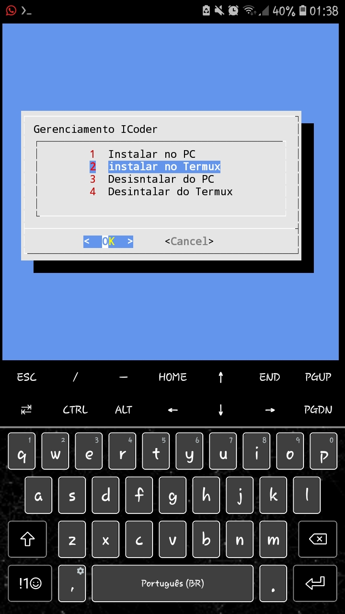
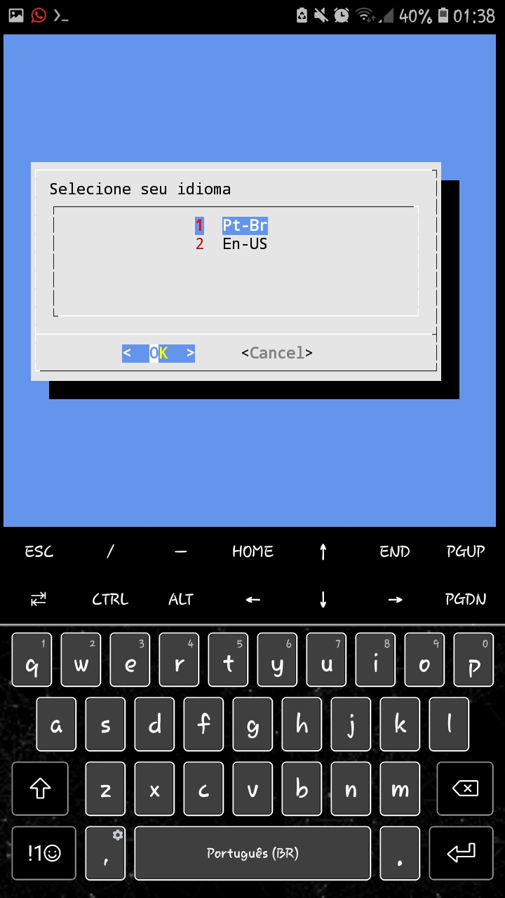
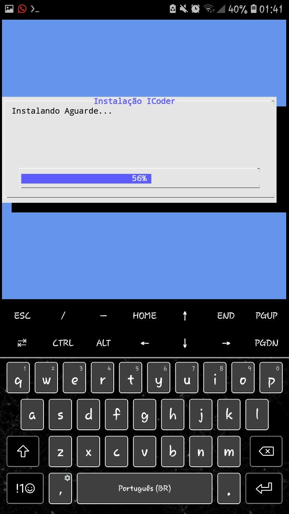
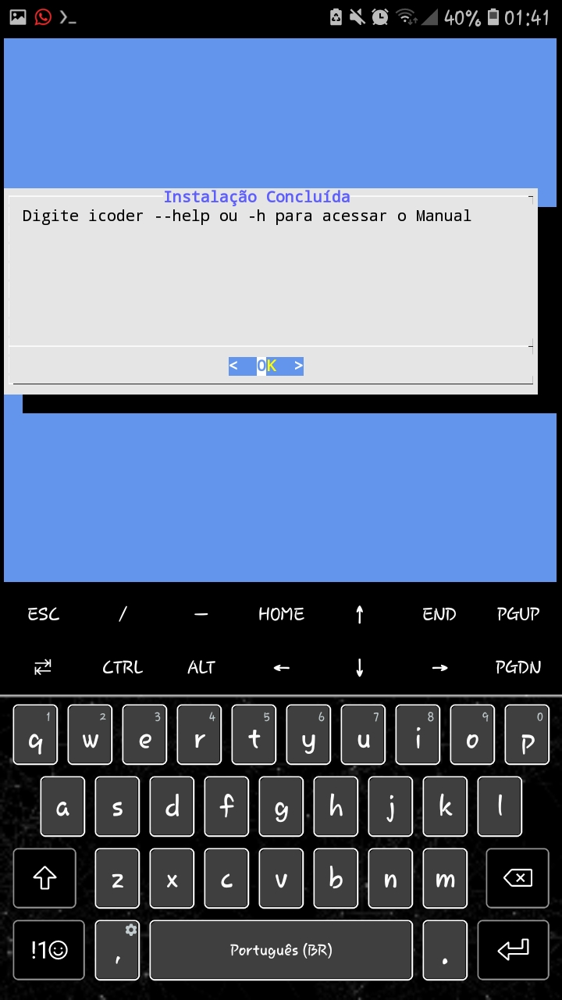
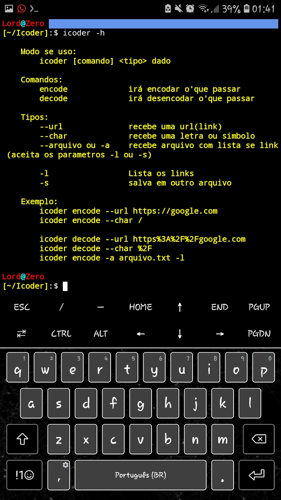

# Icoder
Essa ferramenta foi feita para facilitar encodar e decodar caracteres especiais de url 
<br>Ex: `/`,`\`,`:`, `algumas letras`
# Instalação
Execute o menu de instalação com o comando:
```
bash setup
```
Depois disso selecione Instalar (pc ou termux, depende de onde está rodando a ferramenta)<br>
<br>
Na próxima tela verá um menu de seleção de idiomas pro manual (só precisará destes passos 1 vez) <br>
<br>
Após isso tudo será configurado automaticamente incluindo manual no idioma selecionando<br>


<br>

# Desinstalação
Rode o comando 
```
bash setup
```
Selecione a opção "Desinstalar" na opção que tiver rodando


# Dependências
-Python3
-Bash(linux)

# Modo de uso:
Digite `icoder -h` ou `icoder --help` para ter acesso ao manual da ferramenta, somente em português e inglês por enquanto
